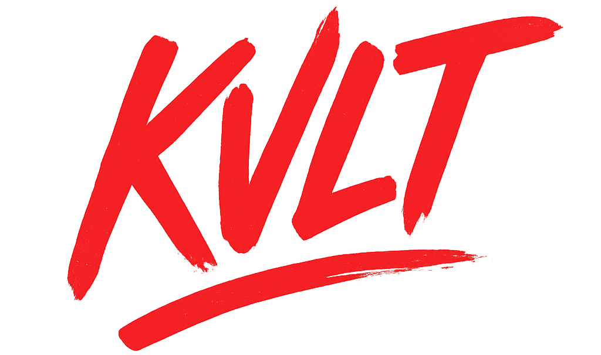

  

  Kvlt Database

  
  

## Introduction

**Kvlt** est un projet de mini base de données en mémoire inspiré de Redis, conçu pour offrir des fonctionnalités de **stockage clé-valeur simples et efficaces**. Ce projet a pour but de fournir une compréhension approfondie des concepts fondamentaux de la gestion de cache et des protocoles de communication entre un client et un serveur.

## Utilité

**Kvlt** permet aux développeurs de stocker et de récupérer des données rapidement grâce à une **interface HTTP simple**. Il est idéal pour les applications nécessitant un accès rapide aux données, comme les sessions utilisateur, les résultats de requêtes fréquentes ou tout autre type de données temporaires. En utilisant ce mini Redis, les utilisateurs peuvent expérimenter avec les principes de base de la gestion de cache et du développement de services web.

## Cahier des charges

1. **Fonctionnalités principales :**
   - Stockage de paires clé-valeur en mémoire.
   - Récupération de valeurs par clé.
   - Interface HTTP pour interagir avec le cache.

2. **Architecture :**
   - Utilisation de Go comme langage de programmation principal.
   - Mise en place d'un serveur HTTP pour gérer les requêtes.
   - Conteneuriser l'application avec Docker pour faciliter le déploiement et la portabilité.

3. **Documentation :**
   - Fournir une documentation claire sur l'utilisation de l'API.
   - Expliquer les commandes disponibles et leur fonctionnement.

4. **Tests (optionnel) :**
   - Écrire des tests unitaires pour les fonctionnalités critiques.
   - Assurer la couverture du code pour garantir la fiabilité de l'application.

5. **Configuration :**
   - Permettre la configuration de l'application via un fichier de configuration.

## Prérequis

- Go
- Docker

## :warning: Attention

**Ce projet est créer dans le cadre d'un cours de développement et n'est pas destiné à être utilisé en production.** Je vous remercirai de ne pas l'utiliser ni de prendre exemple sur ce projet pour vos propres projets.
