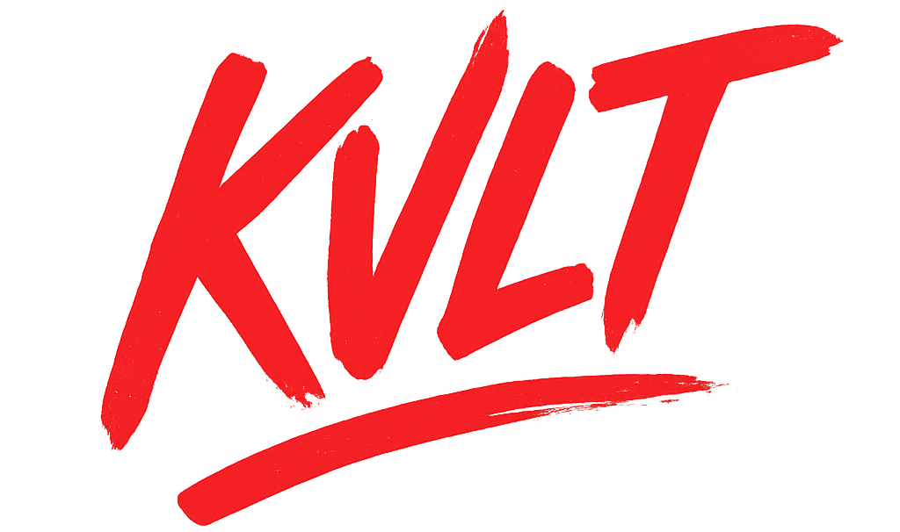

  

  Kvlt Database

  

## Présentation

**KVLT** est une base de données clé-valeur en mémoire inspirée de Redis, conçue pour offrir un stockage de données simple, rapide et performant. Elle propose une solution légère pour les applications nécessitant un accès rapide aux données sans la complexité des systèmes de base de données traditionnels.

## :warning: Avertissement

**Ce projet est créé dans le cadre d'un cours de développement et n'est pas destiné à être utilisé en production**. Merci de ne pas l'utiliser ni de prendre exemple sur ce projet pour vos propres projets.
