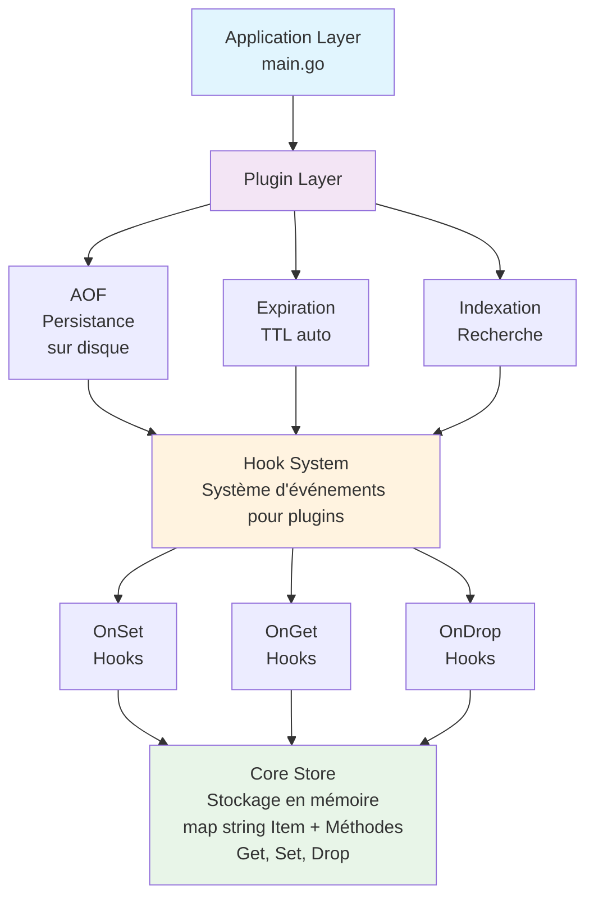
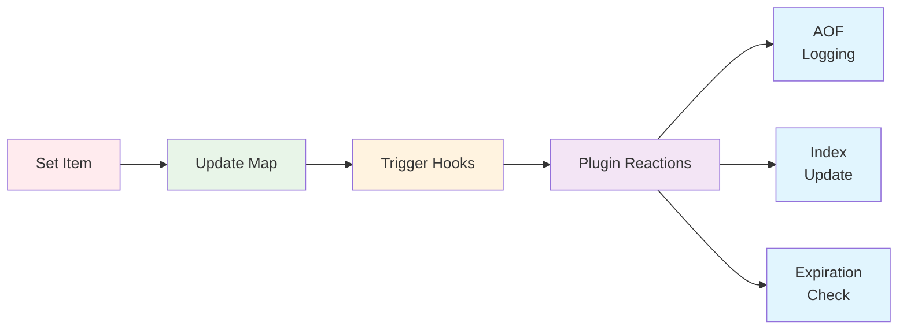
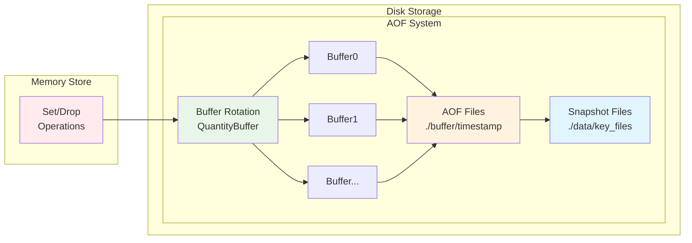
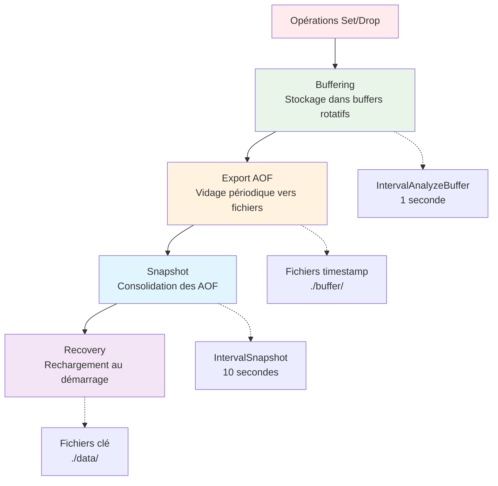
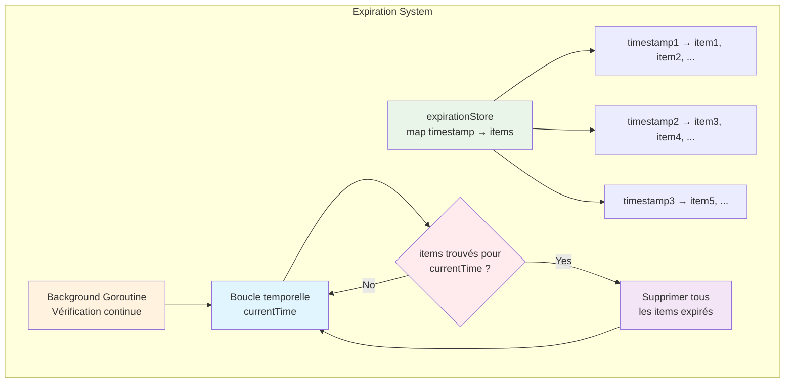
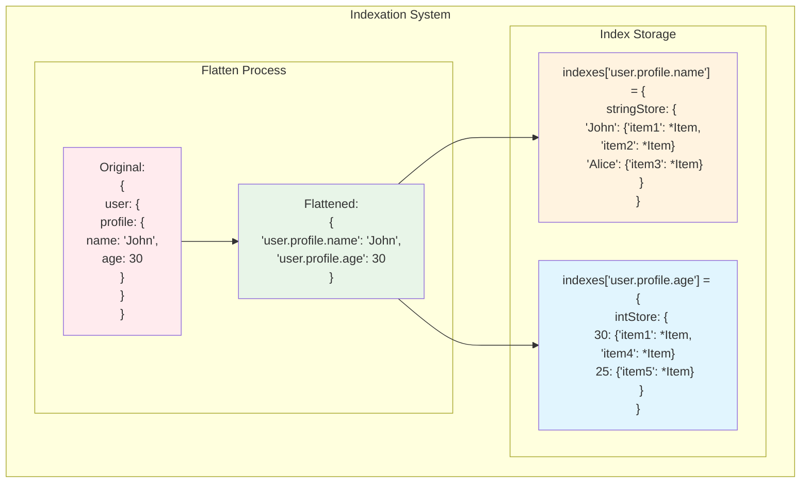
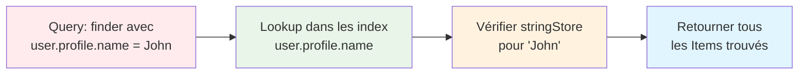
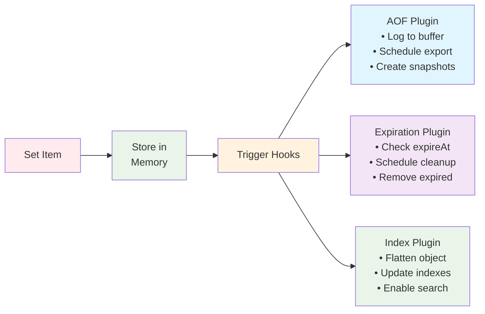

<p align="center">
  
</p>
<p align="center">
  <span style="font-size: 24px; font-weight: bold;">Kvlt Database</span>
</p>
<p align="center">
  <a href="#">
    
  </a>
</p>

## Présentation Générale

**KVLT** est une base de données clé-valeur en mémoire inspirée de Redis, développée en Go. Elle offre un système de stockage rapide avec plusieurs plugins pour étendre ses fonctionnalités :

- **Persistance** via AOF (Append-Only File)
- **Expiration automatique** des données
- **Indexation** pour des requêtes rapides
- **Architecture modulaire** avec système de hooks

---

## Architecture par Couches



### Principe des Couches

1. **Core Store** : Stockage de base en mémoire avec les opérations CRUD
2. **Hook System** : Système d'événements permettant aux plugins de réagir aux opérations
3. **Plugin Layer** : Plugins modulaires qui étendent les fonctionnalités
4. **Application Layer** : Point d'entrée de l'application

---

## Le Store Principal

### Structure de Données

```go
type Item struct {
    Value interface{}  // Valeur stockée (peut être de n'importe quel type)
    Key   string      // Clé unique d'identification
}

type Store struct {
    data        map[string]Item  // Stockage principal en mémoire
    actionHooks ActionHooks     // Hooks pour les plugins
}
```

### Opérations de Base

- **`Get(key string)`** : Récupère un élément par sa clé
- **`Set(item Item)`** : Stocke un nouvel élément
- **`Drop(key string)`** : Supprime un élément

### Flux d'Exécution



---

## Système de Hooks

Le système de hooks permet aux plugins de s'abonner aux événements du store :

```go
type ActionHooks struct {
    get  []func(item *Item)  // Déclenchés lors d'un Get
    set  []func(item *Item)  // Déclenchés lors d'un Set
    drop []func(item *Item)  // Déclenchés lors d'un Drop
}
```

### Avantages
- **Modularité** : Chaque plugin peut s'enregistrer indépendamment
- **Asynchrone** : Les hooks sont exécutés en goroutines
- **Extensibilité** : Facile d'ajouter de nouveaux plugins

---

## Plugin AOF (Append-Only File)

### Principe

L'AOF assure la **persistance des données** en journalisant toutes les opérations sur disque.

### Architecture AOF



### Configuration

```go
type OptionsAOF struct {
    IntervalAnalyzeBuffer time.Duration  // Fréquence de vidage des buffers
    IntervalSnapshot      time.Duration  // Fréquence de création des snapshots
    QuantityBuffer        int           // Nombre de buffers rotatifs
    AOFFolderPath         string        // Dossier des fichiers AOF
    SnapshotFolderPath    string        // Dossier des snapshots
    SplitChar             string        // Caractère de séparation
}
```

### Processus de Fonctionnement



1. **Buffering** : Les opérations sont stockées dans des buffers rotatifs
2. **Export AOF** : Périodiquement, les buffers sont vidés vers des fichiers AOF
3. **Snapshot** : Les fichiers AOF sont consolidés en snapshots
4. **Recovery** : Au démarrage, les snapshots sont rechargés en mémoire

### Format des Fichiers AOF

```
action|\\|\\|key|\\|\\|{"Key":"test","Value":{"name":"john"}}
set|\\|\\|user1|\\|\\|{"Key":"user1","Value":{"name":"Alice","age":30}}
drop|\\|\\|user2|\\|\\|{"Key":"user2","Value":null}
```

### Avantages
- **Durabilité** : Aucune perte de données en cas de crash
- **Performance** : Système de buffers pour éviter les I/O trop fréquentes
- **Récupération** : Restauration automatique au démarrage

---

## Plugin d'Expiration

### Principe

Le plugin d'expiration permet de définir une **durée de vie** aux données stockées.

### Architecture d'Expiration



### Fonctionnement

1. **Détection** : Lors d'un `Set`, recherche de la propriété `expireAt`
2. **Stockage** : Les items avec expiration sont indexés par timestamp
3. **Surveillance** : Une goroutine vérifie en continu les expirations
4. **Suppression** : Les items expirés sont automatiquement supprimés

### Format des Données avec Expiration

```go
store.Set(Item{
    Key: "session_token",
    Value: map[string]interface{}{
        "token": "abc123",
        "userId": 42,
        "expireAt": time.Now().Unix() + 3600, // Expire dans 1 heure
    },
})
```

### Avantages
- **Automatique** : Pas besoin de gérer manuellement les suppressions
- **Flexible** : Expiration par item individuel
- **Performant** : Vérification optimisée par timestamp

---

## Plugin d'Indexation

### Principe

Le plugin d'indexation permet de **rechercher rapidement** des données par leurs propriétés internes.

### Architecture d'Indexation



### Structure des Index

```go
type Index struct {
    intStore     Record[int64, RecordItem]   // Index pour les entiers
    stringStore  Record[string, RecordItem]  // Index pour les chaînes
    nullStore    RecordItem                  // Index pour les valeurs null
    booleanStore Record[bool, RecordItem]    // Index pour les booléens
}

type Indexes Record[string, Index] // Index par chemin de propriété
```

### Processus de Recherche



### Exemple d'Utilisation

```go
// Stockage
store.Set(Item{
    Key: "user1",
    Value: map[string]interface{}{
        "profile": map[string]interface{}{
            "name": "John",
            "age": int64(30),
        },
        "active": true,
    },
})

// Recherche
finder := InitIndexes(store)
results := finder("profile.name", "John")      // Trouve user1
results = finder("profile.age", int64(30))     // Trouve user1
results = finder("active", true)               // Trouve user1
```

### Avantages
- **Performance** : Recherche O(1) au lieu de O(n)
- **Flexibilité** : Index automatique sur toutes les propriétés
- **Types multiples** : Support des strings, int64, bool, null

---

## Exemple d'Utilisation

Voici un exemple complet d'utilisation de KVLT avec tous ses plugins :

```go
func main() {
    // Configuration AOF
    optionsAOF := store.OptionsAOF{
        IntervalAnalyzeBuffer: 1 * time.Second,
        IntervalSnapshot:      10 * time.Second,
        QuantityBuffer:        10,
        AOFFolderPath:         "./buffer",
        SnapshotFolderPath:    "./data",
        SplitChar:             "|\\|\\|",
    }

    // Initialisation du store
    storeInstance := store.NewStore()

    // Activation des plugins
    store.InitExpiration(storeInstance)
    store.InitAOF(storeInstance, optionsAOF)
    finder := store.InitIndexes(storeInstance)

    // Stockage d'un objet complexe avec expiration
    storeInstance.Set(store.Item{
        Key: "user_session",
        Value: map[string]interface{}{
            "userId": int64(123),
            "profile": map[string]interface{}{
                "name": "John Doe",
                "role": "admin",
            },
            "expireAt": time.Now().Unix() + 3600, // Expire dans 1h
        },
    })

    // Recherche par propriété
    adminUsers := finder("profile.role", "admin")
    fmt.Printf("Utilisateurs admin: %v\n", adminUsers)

    // Les données sont automatiquement:
    // - Persistées sur disque (AOF)
    // - Indexées pour la recherche
    // - Expirées après 1 heure
}
```

### Flux Complet



---

## Avantages de l'Architecture

1. **Modularité** : Chaque plugin est indépendant et peut être activé/désactivé
2. **Performance** : 
   - Stockage en mémoire pour la vitesse
   - Index pour les recherches rapides
   - Buffers AOF pour optimiser les I/O
3. **Robustesse** :
   - Persistance via AOF
   - Récupération automatique au démarrage
   - Gestion automatique des expirations
4. **Extensibilité** : Système de hooks permet d'ajouter facilement de nouveaux plugins

Cette architecture fait de KVLT une base de données clé-valeur complète et performante, adaptée aux besoins modernes de stockage temporaire et de cache.

